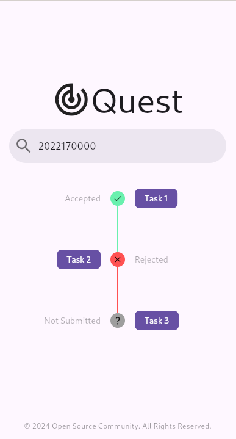
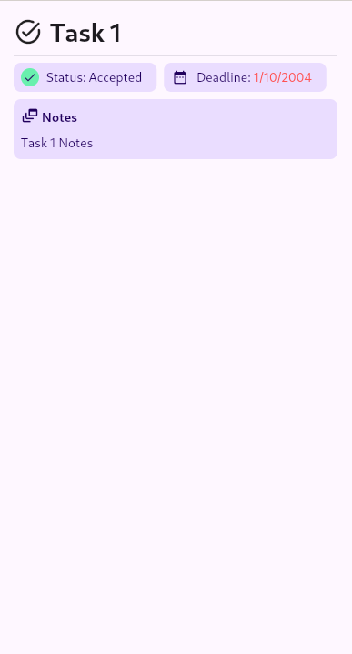
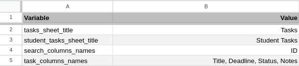
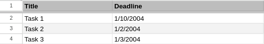
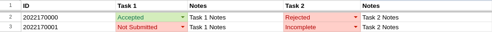
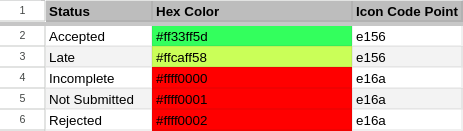

<div align="center">

<div style="display: flex; align-items: center; justify-content: center;">
  
</div>
<h1>Quest</h1>
<b>
    Quest is a lightweight frontend application designed to display tasks from a Google Sheet.
</b>
<hr />
</div>


<div style="display: flex;">
  
  
</div>

## Build

### Setting Environment Variables

Quest requires certain environment variables to function correctly. You can set these using a `.env` file or system environment variables:

#### `.env` file

```env
GSHEET_CREDENTIALS=YOUR_GHEET_CREDENTIALS
GSHEET_SPREADSHEET_ID=YOUR_GHEET_SPREADSHEET_ID
```

#### System Environment Variables

```bash
export GSHEET_CREDENTIALS=YOUR_GHEET_CREDENTIALS
export GSHEET_SPREADSHEET_ID=YOUR_GHEET_SPREADSHEET_ID
```

After setting up the environment variables, run the generator:

```bash
dart run build_runner build
```

> [!IMPORTANT]
> Add both `.env` and `env.g.dart` files to your `.gitignore` file, otherwise, you might expose your environment variables.

### Web

```bash
flutter build web --release --no-tree-shake-icons --base-href /example-href/
```

## Google Sheets Setup

Quest requires the following worksheets to function properly.

### Quest Settings

The `Quest Settings` worksheet is used to customize the application’s behavior.

> [!IMPORTANT]
> Verify that the Google spreadsheet used with Quest includes a worksheet named `Quest Settings`.

| Variable | Description | Required |
| -------- | ----------- | -------- |
| `tasks_sheet_title`         |  Title of tasks worksheet. | ✔️ |
| `student_tasks_sheet_title` |  Title of student tasks worksheet. | ✔️ |
| `search_columns_names`      |  Columns to search for student tasks. | ✔️ |
| `task_columns_names`        |  Display names for task columns in the Quest interface, starting with columns from the `Tasks` worksheet, followed by columns from the `Student Tasks` worksheet.  | ✔️ |
| `status_sheet_title`        |  Title of the status worksheet. | ❌ |

> [!IMPORTANT]
> The `Quest Settings` worksheet must include `Variable` and `Value` columns.



### Tasks Worksheet

The `Tasks` worksheet serves two primary functions:
  1. Identify tasks in `Student Tasks` worksheet.
  2. Contains global task information such as deadlines.

> [!IMPORTANT]
> The `Tasks` worksheet must have a unique `Title` column.

> [!TIP]
> `Deadline` column is unique in that it automatically changes to a red color when a deadline has passed.
> `Deadline` column uses (`d/m/yyyy`) date format.



### StudentTasks Worksheet

The `Student Tasks` worksheet tracks student task status, notes and any other specific information.

> [!CAUTION]
> Avoid including sensitive information in the Student Tasks worksheet (e.g., phone numbers, social security numbers), as student filtration is done client-side.

| Column | Description | Required |
| ------ | ----------- | -------- |
| `Task ID` | The task's key, which must also exist in the `Tasks` worksheet. | ✔️ |

> [!TIP]
> Any task specific column, except for the `Task ID`, will be displayed as a card on the Task Details page. For example, the `Notes` column. Supports `Markdown`



## Configuration

### Status names, Color and Icons

Customize task status colors and icons by providing a status worksheet in the specified format.

> [!IMPORTANT]
> Ensure that `status_sheet_title` variable is defined in `Quest Settings`.

| Status        | Hex Color | Icon Code Point |
| ------------- | --------- | --------------- |
| Accepted      |	#ff33ff5d |	e156 |
| Late          |	#ffcaff58	| e156 |
| Incomplete    |	#ffff0000 |	e16a |
| Not Submitted |	#ffff0001 |	e16a |
| Rejected      |	#ffff0002 |	e16a |

> [!NOTE]
> Status names are customizable and not fixed to the provided example.



Find icon code points in the [Flutter Icons documentation](https://api.flutter.dev/flutter/material/Icons-class.html).
